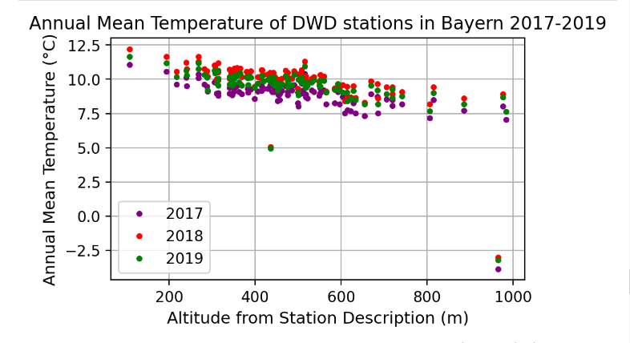

# Task 1

In the troposphere the mean annual temperature decreases approximately linearly with height. Verify this hypothesis by means of data in Bavaria. This federal state reveals the broadest range of topographic heights, from 100m to more than 2800m above Normal-Null (NN).

You can start from the Jupyter Notebook gnb0181_DWD_NRW_Annual_Temp_vs_Altitude_V001.ipynbin the WS2021 geodata repo.

## Sub-Task 1.1 Question:

Plot the annual mean temperatures of years 2017, 2018, and 2019 versus altitude for the DWD stations in Bavaria in one diagram (xy scatter plot). Use different colors for the different years. Use the altitudes from the station description file KL_Jahreswerte_Beschreibung_Stationen.txt for the data set /annual/kl/historical/.

## Sub-Task 1.1 Answer:

Working on Jupyter Notebook Task01, we setup an FTP server connection so we can extract all data automatically from DWD website, and import them into a Pandas dataframe.
After importing the data we realized a problem in the values column of the dataframe, the stations that have 4 digits altitude (over 1000 meters) are not showing first digit on the left. For example instead of showing 2965 meters of altitude for the station of Zugspitze, it shows 965 meters.
After working on Jupyter Notebook Task01, and filter the stations that are active between 2017 and 2019 as stated in the question, we identified only 2 stations over 1000 meters of altitude.

First we were asked to verify this hypothesis: "In the troposphere the mean annual temperature decreases approximately linearly with height."
We worked on 4 stations that have the ids of 2480, 6346, 2290, 5792. The altitudes of these stations are 108 meters, 531 meters, 977 meters, 2965 meters, respectively.
We renamed the columns so the highest station "Zugspitze" will show the real altitude 2965 meters.
After plotting these 4 stations, we can verify the hypothesis. It is clearly demonstrated that each time the altitude is higher, the temperature is proportionally lower.

To plot the temperature versus altitude of all Bavaria stations in a scatter plot, we did a series of steps in Task01 jupyter notebook.
There are 2 stations in the results that have more than 1000 meters of altitude but they miss the first digit on the left so the results that we got shows a correlation between all the other stations, but only these 2 stations are not correlated with the others at all.

## Sub-Task 1.2 Question:

The DTM of Bavaria with 50m horizontal resolution in EPSG:25852 as GeoTiff (500 MB!) can be downloaded from here:
http://www.geodaten.bayern.de/opendata/DGM50_UTM32/dgm50_epsg25832.tif

Create a decent map (including title, annotations, scales, legends, north arrow, graticule, CRS, data source references, etc.) with all DWD temperature stations in Bavaria which were active in the years of concern (2017, 2018, 2019). There are several ways to get a station layrer in QGIS. You can e.g. use Jupyter to create a CSV file from the DWD station description, import it to QGIS and limit it to Bavaria. Or you can create a geopackage with geopandas. Or you find other methods. Label the stations with their station id (number).

Use the DTM as a map layer in the background. Try to find the digital administrative boundaries of Bavaria and overlay the disctrict boundaries as well as the boundary of the federal state. Crop the DTM to the boundary of Bavaria precisely. Use an appropriate color map to display the DTM as in topographic maps. Search the Internet for how to select and load suitable color maps in QGIS. Probably you still have to apply fine adjustments in the mapping of the colors to terrain elevation: Low lands green, higher elevations brown, the Alpine peaks white, and finally bluish for low land rivers, if possible.

## Sub-Task 1.2 Answer:

Creating the map using the following steps:
1- After downloading the DTM of Bavaria, we add the layer to the QGIS as a raster layer.
2- In Jupyter notebook Task01, we download a csv file for the stations of Bavaria to use it in QGIS. We upload it as a Delimited Text Layer.
3- In the end we add the shape file of the administrative boundaries of Bavaria as a vector layer.
4- Editing the station layer to change the station shape to star and the color to red. We Changed also the station numbers color to white with black borders and make the font 10 to be more clear.
5- In the shape layer, we use the color ramp of the elevation that is stored in QGIS which shows the lowest altitude as light blue and the highest as black passing by green, yellow, orange and brown.
6- Open street map layer is kept in the bottom of the layers as a background.
7- Using the Layout manager, we add a longitude and latitude, title, north arrow, source and scale bar.

## Sub-Task 1.3 Question:

Sample the DTM at the locations of the DWD stations.

Use the QGIS Processing Toolbox to do so. Use the dialog Sample Raster Values from the Raster Analysis Toolbox. Selecting the menu item Processing -> Toolbox toggles the visibility of the Toolbox pane. From this select Raster Analysis.

Add another field to the DWD stations attribute table with the altitudes sampled from the DTM. Compare the original altitudes from the DWD station file to the heights derived from the DTM. Where and why are the strongest deviations?

## Sub-Task 1.3 Answer:

Reactivating the "Processing" in the plugins, we can access the "Sample raster value" under the "Raster analysis".

The data was copied from the attribute table to a CSV file and loaded the file in Task01 Jupyter notebook to check which stations have the difference in altitude.
Comparing the original altitudes from the DWD station file to the heights derived from the DTM, we only have 2 stations with a huge difference. The stations are Zugspitze and Großer Arber

## Sub-Task 1.4 Question:

Plot the mean annual temperatures versus the DTM heights for the DWD stations in Bavaria. Perform a linear regression with numpy to the data (not Excel!!!). How does the temperature vary with height according to your regression model, i.e. what is the temperature gradient (the slope of the regression line) in units K/m or °C/m?

## Sub-Task 1.4 Answer:

Plotting the mean annual temperatures versus the DTM heights for the DWD stations in Bavaria is done in Task01 Jupyter notebook.

According to the plotting the line is almost linear but the slope is negative. There is a negative correlation between the temperature and the altitude. Each time the altitude is higher, the temperature is proportionally lower. The temperature gradient is approximately 6°C/1000m or 0.006°C/m.