# Task03

## Sub-Task 3.1 Question:

Sub-Task 3.1:
Georeference the picture of the map above. Start with the QGIS project gdms0000_Burial_Mounds_Uedem_V001.qgz in the assignment folder. Georeference the picture of the map by means of the QGIS Georeferencer together with the layer DTK10, the NRW topographic map in 1:10000, already imported from the NRW WMS server and added in the QGIS project. Use crossing forest trails, crossroads, road junctions and other features you can identify on DTK10 as land marks (aka ground control points, GCP) with known coordinates (can be read from the QGIS map canvas). Use EPSG:25832. Add the georeferenced map to the QGIS project.

## Sub-Task 3.1 Answer:

The layers were already provided. To georeference the picture with the NRW map, these steps were used:

1- Opening the "Georeferencer" tool under the Raster option.
2- Uploading the "Burial_Mounds" picture found in the "images" folder
3- Start Picking points that are clearly on the intersections, road junctions, or road corners and pointing them on the map using the "From Canvas Map" option.
4- 22 points were used to georeference the picture of the map with the NRW topographic map "DTK10"
5- Clicking on start referencing and fixing the parameters
6- Transformation type: Thin Plate Spline
7- Resampling method: Nearest Neighbour
8  Target SRS: EPSG: 25832
9- Adding a title, north arrow and a scale bar found in the "view" > "decorations" option.

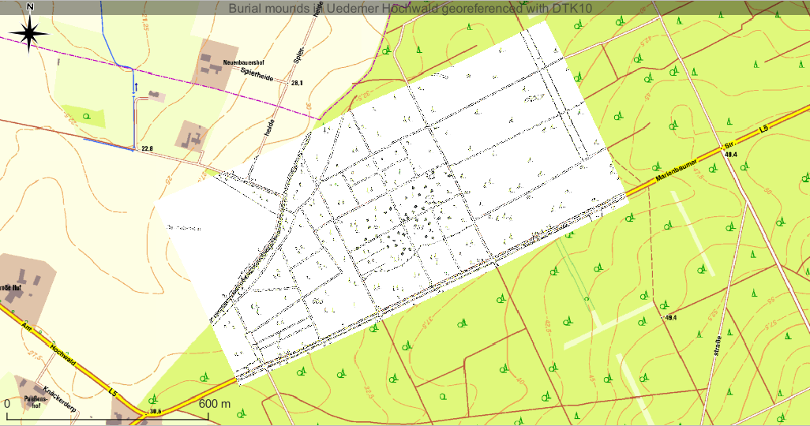

Task 3.1 QGIS file can be found under Task_3.1 name.

## Sub-Task 3.2 Question:

Create a hillshade model from the DTM layer. Plot your georeferenced map partly transparent on top of the hillshade model. Compare. What do you observe? How good is the georeferenced map section showing the burial mounds?

## Sub-Task 3.2 Answer:

Using the "DTM_Uedemer_Hochwald_N" layer, we create a hillshade following these steps:

1- Right click on "DTM_Uedemer_Hochwald_N" layer" > properties > Symbology
2- Render type: Hillshade
3- Changing the Z Factor to 15 to better show the shades and the landforms.
4- Keeping the transparency to 100% since this layer will be in the background.

Using the "Burial_Mounds_modified" layer on top of the DTM layer and the Transparency in the properties to 50%.
That was the best value to better show the landforms and the drawn picture of the burial mounds together.

Looking at the pictures, the burial mounds in the "DTM_Uedemer_Hochwald_N" layer are placed in the east, north-east or north of the black circles that represents the burial mounds in the drawn picture.

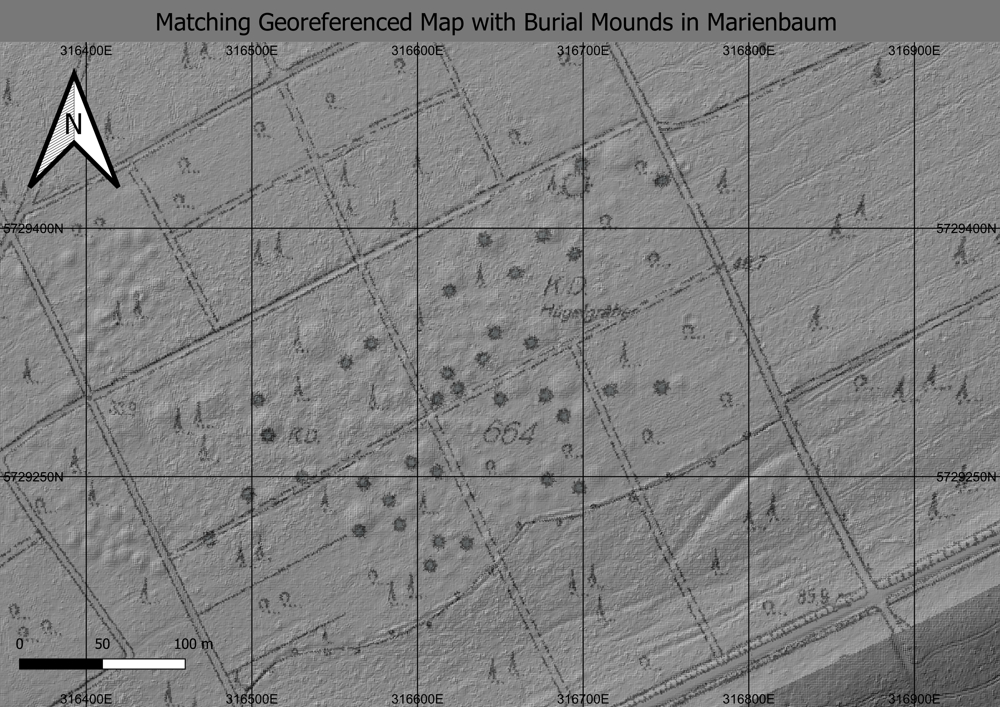

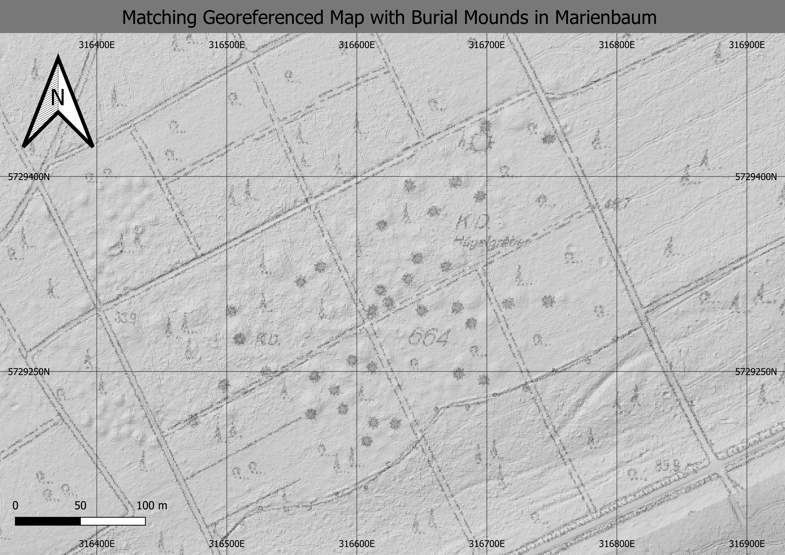
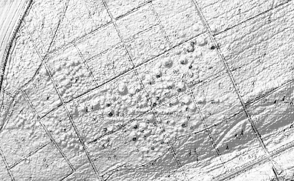

In the last 2 pictures, we changed little bit in the options and zoom in to show the difference in other way. Z Factor was set to 20 in the last picture.

The georeferenced map is very precise matching the burial mounds but the question is why they have almost all equals distance to the east, north-east, or north direction.

Task 3.2 QGIS file can be found under Task_3.2 name.

## Sub-Task 3.3 Question:

Use the DTM (not the hillshapde model!) and measure the typical mound heights relative to their direct environment/neighborhood (not the absolute height above sealevel!). What is their typical elvation in the landscape?

## Sub-Task 3.3 Answer:

To measure the mound heights relative to their direct environment, the "profile tool" plugin was installed.
Clicking on Plugins > Profile Tool > Terrain Profile, we can access the profile tool to measure directly on the map.
Simply drawing a line over the mounds in the DTM layer to measure their elevations. We extended the line as much as we can so we can identify the heights. We used many lines over many burial mounds with many directions so we can take a better idea about the elevations.

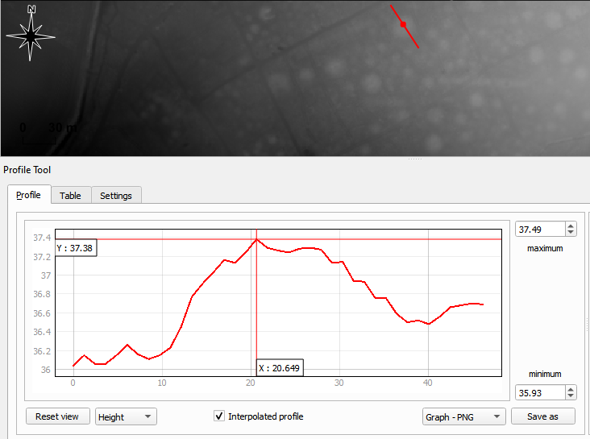
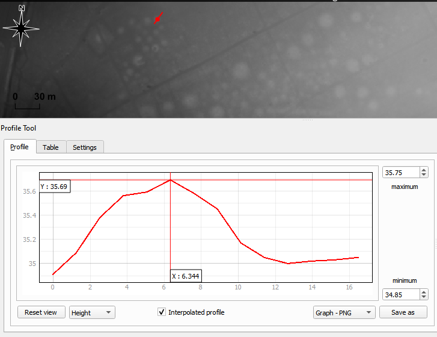

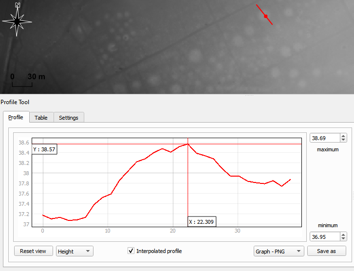
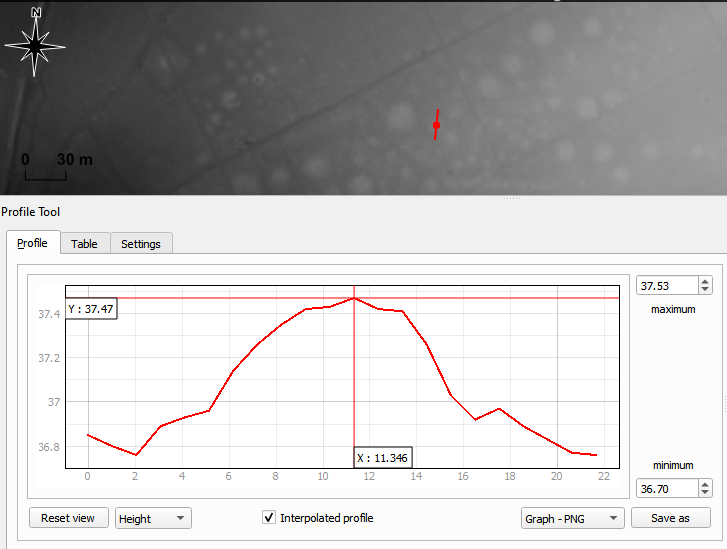
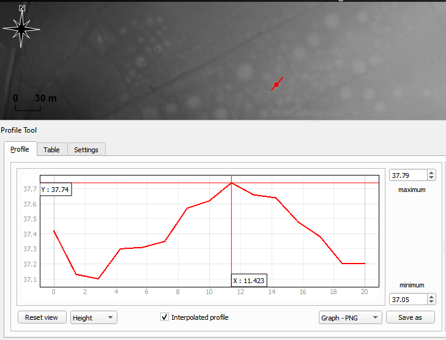

In the pictures, the red lines on the map are showing the relative burial mounds measured, and we can see in the table the elevation above the sea. The lines were drawn from the top to the bottom, so it is reflected in the graph starting from 0 on the x axis.
The x axis represent the distance in meters of the red line, and the y line represents the elevation above the sea.
In order to identify how much is the elevation from the direct environment we can see the tables. For example in the picture number one we can see that the lowest elevation is approximately 36 meters above the sea and the highest is approximately 37.4 meters, it means the direct environment elevation in this burial mound is 1.4 meter.
Some of them have 1.5 meters direct environment elevation, others have 0.5 meters. The average range concluded is between 0.5 and 1.5 meters. 
We can also see an elevation difference above the sea between the burial mounds themselves, that is logically showing that the land is not completely flat, it has a small angle, starting from the left burial mounds measured at 35 meters above the sea to the last burial mounds measured on the right at 38 meters, at the lowest points measured.

No QGIS for task 3.3 since we use external plugin and we should install it everytime we use it, but all the steps and the pictures are documented.

## Sub-Task 3.4 Question:

Study the hillshade model in direction East-North-East of the burial mounds area and search for weakly visible rectangular structures which are not paths. What do you observe? Do you have a guess about the origin of these patterns? Choose at least one of the structures, digitize it with a polygon and save it as a geopackage.

## Sub-Task 3.4 Answer:

The study of the hillshade model in the direction East-North-East was done in the task 3.2.
A rectangle was drawn on the hillshade model showing the rectangle surrounding the burial mounds.
The geopackage rectangular structure was created by clicking on New Geopackage Layer. Assigning the right folder, name it, set polygon and save it.
Next step is to set a simple line in the symbology and fix the color and width wanted. Here we used the red color and the width 10.
We saved it as a geopackage in a geopackage folder "rectangular_geopackage_structure".
There are a lot of rectangles that are shown very clear in that area. I don't have any guess about these rectangular shapes, I didn't find information online, that's why I will make a visit to the place to get an idea about them.

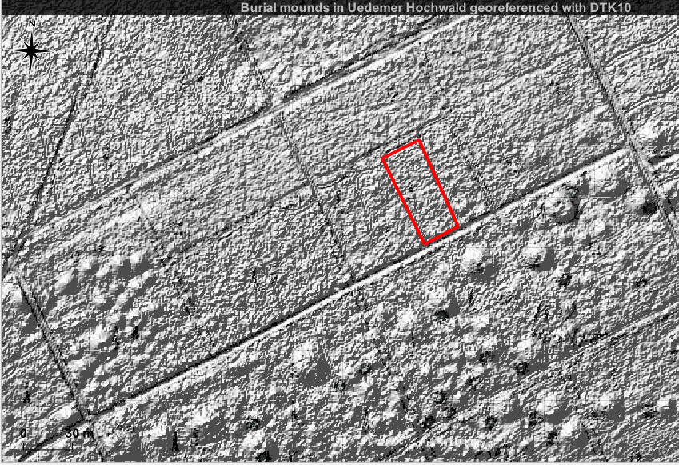
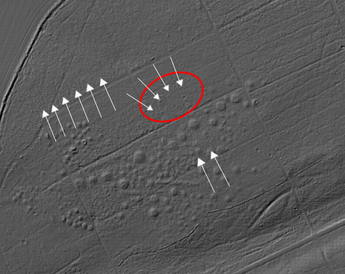

Task 3.4 QGIS file can be found under Task_3.4 name.